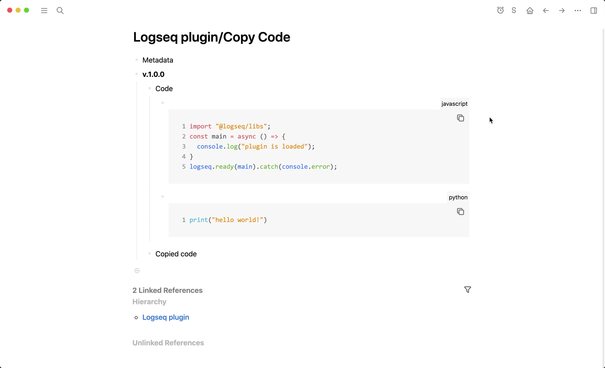
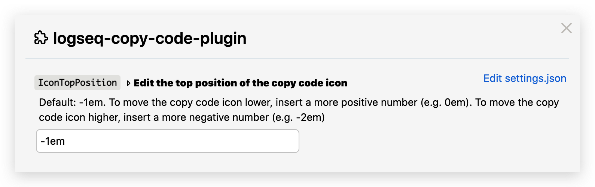

## logseq-copy-code-plugin
> If you find this plugin – or any of my other [Logseq plugins](https://github.com/vyleung?tab=repositories&q=logseq&type=source) – useful and would like to support me, you can [buy me a coffee](https://www.buymeacoffee.com/vyleung) 🙂

🚨 **NOTE:** Your Logseq version must be 0.6.7+ to run this plugin  

## Features
### Copy code from code blocks
- The position of the copy code icon can be configured in the [settings](#settings)
    - The copy code button may disappear if you edit the code block directly rather than in the Code Mirror editor. To get the button to re-appear, you can a new block underneath the code block – OR — toggle the collapse state of any block
#### Demo
  

## Installation
### Preparation
1. Click the 3 dots in the righthand corner → `Settings` → `Advanced` → Enable `Developer mode` and `Plug-in system`
2. Click the 3 dots in the righthand corner → `Plugins` – OR – Use keyboard shortcut `Esc t p`

### Load plugin via the marketplace (not available yet)

### Load plugin manually
1. Download the [latest release](https://github.com/vyleung/logseq-copy-code-plugin/releases) of the plugin (e.g logseq-copy-code-plugin-v.1.0.0.zip) from Github
2. Unzip the file
3. Navigate to plugins (Click the 3 dots → `Plugins` – OR – Use keyboard shortcut `Esc t p`) → `Load unpacked plugin` → Select the folder of the unzipped file

#### Settings
- Each time you make changes to the plugin settings, please reload the plugin to ensure that all settings are updated  

## License
MIT

## Credits
- Plugin Marketplace Icon: <a href="https://www.flaticon.com/free-icons/seo-and-web" title="seo and web icons">SEO and web icons created by kerismaker - Flaticon</a>
- Plugin concept inspired by the [Obsidian Code Block Copy plugin](https://github.com/jdbrice/obsidian-code-block-copy)