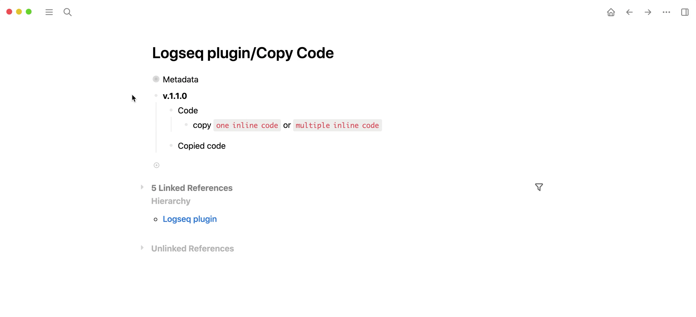

## logseq-copy-code-plugin
> If you find this plugin – or any of my other [Logseq plugins](https://github.com/vyleung?tab=repositories&q=logseq&type=source) – useful and would like to support me, you can [buy me a coffee](https://www.buymeacoffee.com/vyleung) 🙂

🚨 If the plugin doesn't work properly after installing or updating, please refresh Logseq before opening an issue

## Features
### Copy code from code blocks
- The position of the copy code icon can be configured in the [settings](#settings)
#### Demo

### Copy inline code
#### Demo

## Installation
### Preparation
1. Click the 3 dots in the righthand corner → `Settings` → `Advanced` → Enable `Developer mode` and `Plug-in system`
2. Click the 3 dots in the righthand corner → `Plugins` – OR – Use keyboard shortcut `Esc t p`

### Load plugin via the marketplace (recommended)
1. Click the 3 dots in the righthand corner → `Plugins` – OR – Use keyboard shortcut `Esc t p`
2. Go to the `Marketplace` tab and search for `Copy Code` → Click `Install`

### Load plugin manually
1. Download the [latest release](https://github.com/vyleung/logseq-copy-code-plugin/releases) of the plugin (e.g logseq-copy-code-plugin-v.1.0.0.zip) from Github
2. Unzip the file
3. Navigate to plugins (Click the 3 dots → `Plugins` – OR – Use keyboard shortcut `Esc t p`) → `Load unpacked plugin` → Select the folder of the unzipped file

#### Settings
- Each time you make changes to the plugin settings, please reload the plugin to ensure that all settings are updated  

## License
MIT

## Credits
- Plugin Marketplace Icon: <a href="https://www.flaticon.com/free-icons/seo-and-web" title="seo and web icons">SEO and web icons created by kerismaker - Flaticon</a>
- Plugin concept inspired by the [Obsidian Code Block Copy plugin](https://github.com/jdbrice/obsidian-code-block-copy)
